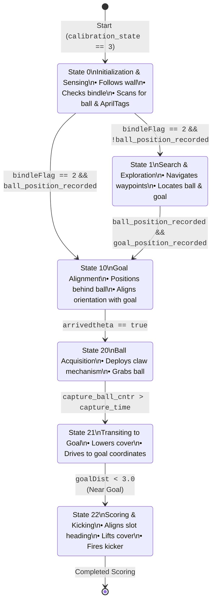

# State Diagram & Flow Logic

This document details the Finite State Machine (FSM) implemented in [FinalProjMain.c](FinalProjMain.c) for the autonomous SLAM Golf Putter.

## Mermaid State Diagram

Paste the code block below into any Markdown previewer (like GitHub, VS Code, or Obsidian), or copy it into [mermaid.live](https://mermaid.live) to render the diagram.

## Detailed State Breakdown

### State 0: Initialization and Sensing
* **Primary Action**: 
  * Executes `rightWallFollow()` to traverse the initial arena walls.
  * Calls `detectAprilTag()`, `detectBall()`, and `checkBindle()` to start mapping and locate components in the workspace.
* **Transitions**:
  * **To State 10**: If the bindle coordinate is updated (`bindleFlag == 2`) and the ball's position has already been localized (`ball_position_recorded`).
  * **To State 1**: If the bindle is updated (`bindleFlag == 2`) but the ball's position has not yet been recorded.

### State 1: Search & Exploration
* **Primary Action**:
  * Clears drive command speeds temporarily, then queries `setwaypoint1()` and navigates via `nav1()`.
  * Continues scanning the vicinity with `detectAprilTag()` and `detectBall()`.
* **Transitions**:
  * **To State 10**: Once both the ball and the target goal positions have been successfully localized.

### State 10: Goal Alignment
* **Primary Action**:
  * Computes an approach waypoint behind the ball that aligns the robot's orientation directly with the goal vector (`setWaypoint2()`).
  * Drives to this approach point and rotates to face the target using `nav2()`.
* **Transitions**:
  * **To State 20**: Once the alignment orientation error threshold is satisfied (`arrivedtheta` flag is set).

### State 20: Ball Acquisition
* **Primary Action**:
  * Triggers the collection mechanism via `captureBall()`.
* **Transitions**:
  * **To State 21**: When the capture time counter exceeds the mechanical delay threshold (`capture_ball_cntr > capture_time`).

### State 21: Transiting to Goal
* **Primary Action**:
  * Actuates the cover servo (`setEPWM5B_RCServo(-80)`) to secure the ball.
  * Queries `setWaypoint3()` (target goal) and navigates towards it using `nav1()`.
* **Transitions**:
  * **To State 22**: When the Euclidean distance to the goal drops below the target threshold (`goalDist < 3.0`).

### State 22: Scoring & Kicking
* **Primary Action**:
  * Rotates to align precisely with the target slot using `turnToGoal()`.
  * Once aligned (`abs(theta_err) < 0.025`), raises the cover (`setEPWM5B_RCServo(0.0)`) and fires the kicker mechanism (`setEPWM5A_RCServo(-50.0)`) to complete the putt.
